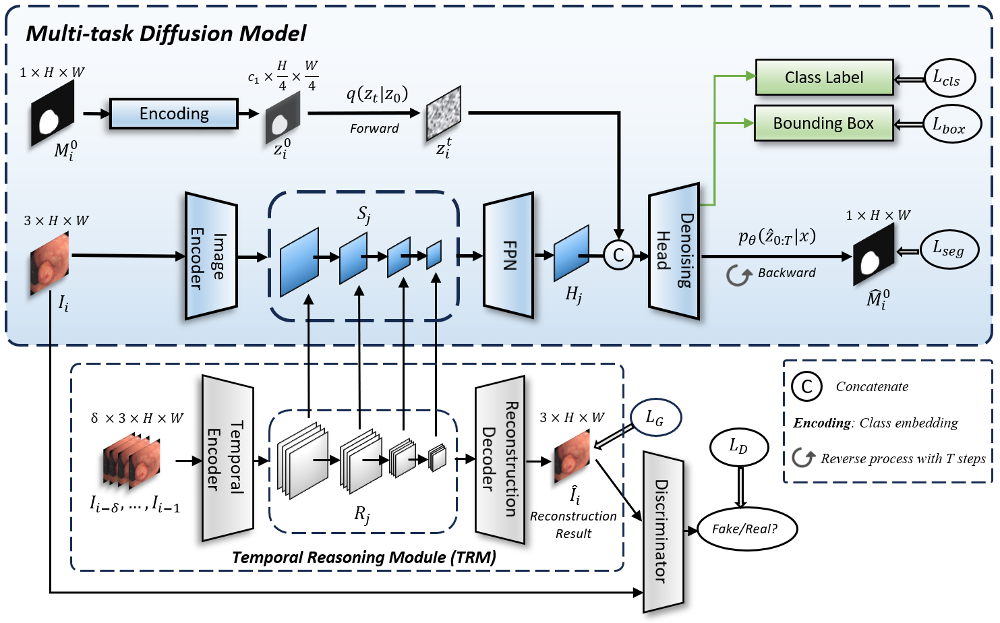
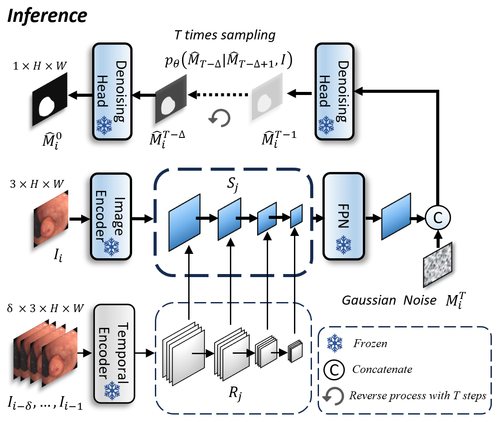

# <p align=center>`Diff-VPS: Video Polyp Segmentation via a Multi-task Diffusion Network with Adversarial Temporal Reasoning (MICCAI 2024)`</p><!-- omit in toc -->
<p align="center">
     <br />
     <br />
</p>

## Table of Contents

- [Data Preprocessing](#data-preprocessing)
- [Model Training](#model-training)
- [Model Testing & Evaluation](#model-testing-&-evaluation)
- [Saving Visualization Results](#saving-visualization-results)
- [Citations](#citations)

## Data Preprocessing <a name="data-preprocessing"></a>

To prepare the data for training and testing, you need to group consecutive frames into clips of 5 frames each. This step is crucial for the model to learn temporal patterns within the video sequences.

To preprocess the data, run:

```bash
python Path2txt_timeclips_5.py
```
This script will generate a train.txt file for training, and four additional files named TextxxxxDataset_xxxx.txt for testing. These files contain the paths to the clips, organized in a format suitable for the model's input pipeline.

## Model Training <a name="model-training"></a>
Once the data is preprocessed, you can proceed to train the model.

To train the model, run:

```bash
python train_diff_vps.py
```
This script initiates the training process, using the train.txt file generated in the previous step as the source of training data. The model will be trained on the specified clips, and the training logs will be saved in the designated directory for further analysis.

## Model Testing & Evaluation <a name="model-testing-&-evaluation"></a>
After training, evaluate the model's performance on the testing dataset.

To test and evaluate the model, use the '# Directly Calculate' in test_diff_vps.py and run:

```bash
sh test.sh
```
This script loads the trained model and evaluates it using the four testing datasets (TextxxxxDataset_xxxx.txt). The evaluation metrics (e.g., accuracy, loss) will be printed to the console or saved in a log file, depending on the script's implementation.

## Saving Visualization Results <a name="saving-visualization-results"></a>
Finally, to gain further insights into the model's predictions, you can generate and save visualization results.

To save visualization results, use the '# Save Image' in test_diff_vps.py and run:

```bash
sh test.sh
```
This shell script orchestrates the visualization process. It may call additional Python scripts or commands to process the model's output and generate visualizations (e.g., images, videos, or plots) that highlight the model's performance on specific examples or across the entire testing dataset. The generated visualizations will be saved in a designated directory for easy access and review.

Please ensure that all necessary dependencies are installed before running these scripts. You can find a list of dependencies in the requirements.txt file (if provided) or consult the project's documentation for further installation instructions.

## Citations <a name="citations"></a>
If you have found our work useful, please use the following reference to cite this project:
